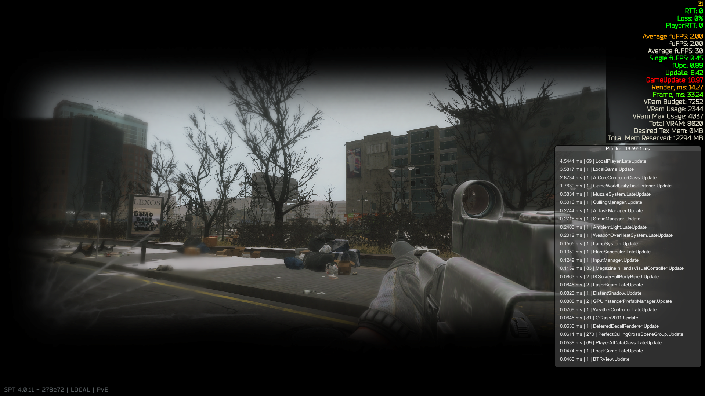

Prototypes of non PIP optic scopes for SPT. 
Each branch is a different research vector. 
Each one has flaws I haven't managed to fix. 
Maybe you can? 
Demonstration (image contains youtube link): 

